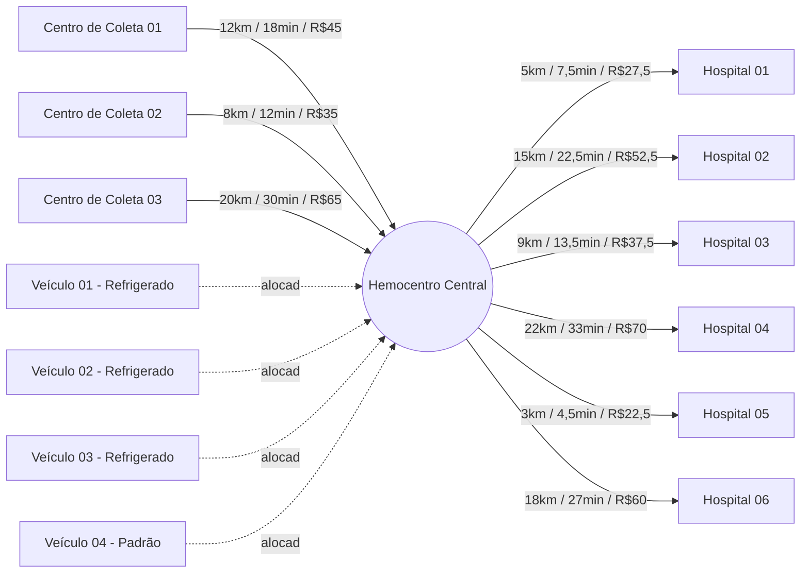

# Escopo do Grafo de Rotas — Hemobit

## 1. Objetivo

Definir o escopo do grafo de rotas que modela o fluxo logístico de
hemocomponentes: **centros de coleta → hemocentro → hospitais**, com o
apoio de **veículos** para o transporte. Este documento serve como
pré-requisito para a implementação do grafo em POO na U2.

O grafo aqui descrito é **sintético** (dados fictícios, coerentes com o
domínio) e tem como objetivo validar a modelagem antes da implementação.

---

## 2. Tamanho do grafo

- **Número máximo de nós definido: 14** (dentro do limite de 15 estabelecido no card).
- Distribuição:
  - 1 Hemocentro
  - 3 Centros de coleta
  - 6 Hospitais
  - 4 Veículos

Esse tamanho é suficiente para exercitar todos os casos de uso (coleta,
distribuição, alocação de veículo, janela de tempo, cadeia fria) sem
tornar o grafo difícil de visualizar, testar ou depurar manualmente.

---

## 3. Tipos de nós

| Tipo             | Descrição                                                                 | Atributos principais |
|-------------------|----------------------------------------------------------------------------|------------------------|
| `hemocentro`      | Nó central único. Recebe hemocomponentes coletados e distribui aos hospitais. | `id`, `nome`, `capacidade_estoque` |
| `centro_coleta`   | Local onde o sangue é coletado de doadores antes de seguir ao hemocentro.  | `id`, `nome`, `capacidade_diaria_bolsas` |
| `hospital`        | Ponto de consumo final, solicita hemocomponentes ao hemocentro.           | `id`, `nome`, `prioridade_media` |
| `veiculo`         | Unidade de transporte, alocada a uma base (hemocentro) e usada nas rotas. | `id`, `placa`, `tipo` (`refrigerado`/`padrao`), `capacidade_bolsas`, `faixa_temp_min_c`, `faixa_temp_max_c` |

> Observação: veículos **não coletam nem armazenam** — eles apenas
> percorrem arestas de transporte. No grafo, cada veículo é modelado
> como nó para permitir consultas do tipo "quais rotas esse veículo já
> cobriu" e para representar sua base de alocação como uma aresta.

---

## 4. Arestas e regras de peso

Existem três tipos de aresta, todas **direcionadas**:

| Tipo de aresta                        | De → Para                     | Significado |
|----------------------------------------|--------------------------------|-------------|
| `coleta_para_hemocentro`               | `centro_coleta` → `hemocentro` | Transporte do sangue recém-coletado até o hemocentro |
| `hemocentro_para_hospital`             | `hemocentro` → `hospital`      | Distribuição de hemocomponentes do estoque a um hospital |
| `veiculo_alocado`                      | `veiculo` → `hemocentro`       | Vínculo do veículo à sua base (peso 0, apenas estrutural) |

### 4.1 Regras de peso

Cada aresta de transporte (`coleta_para_hemocentro` e
`hemocentro_para_hospital`) carrega três pesos:

- **`distancia_km`** — distância rodoviária estimada entre origem e destino.
- **`tempo_min`** — calculado como `distancia_km / velocidade_media_kmh * 60`,
  usando `velocidade_media_kmh = 40` (trânsito urbano/rodovia mista) como
  padrão sintético.
- **`custo_reais`** — calculado como `custo_base + distancia_km * custo_por_km`,
  com `custo_base = 15` e `custo_por_km = 2.5` (valores sintéticos).

A aresta `veiculo_alocado` tem peso fixo `0` em todas as dimensões —
ela existe apenas para representar de onde o veículo parte.

---

## 5. Regras de cadeia fria e janela de tempo (simplificadas)

Cada hemocomponente transportado tem uma janela máxima de tempo fora
de condições ideais e uma faixa de temperatura obrigatória. Para este
escopo, simplificamos em três categorias:

| Hemocomponente          | Faixa de temperatura | Janela máxima de transporte |
|--------------------------|------------------------|-------------------------------|
| Concentrado de hemácias  | 2°C a 6°C              | 30 horas |
| Concentrado de plaquetas | 20°C a 24°C (agitação contínua) | 4 horas |
| Plasma fresco congelado  | -18°C ou menos         | 72 horas |

**Regras de validação da rota:**

1. Toda aresta de transporte (`coleta_para_hemocentro` ou
   `hemocentro_para_hospital`) só é considerada **válida** se o
   `tempo_min` da rota for menor ou igual à janela máxima do
   hemocomponente transportado.
2. O veículo usado na rota precisa ser do tipo `refrigerado` sempre
   que o hemocomponente exigir faixa de temperatura diferente da
   ambiente (todos os casos acima, exceto eventualmente insumos não
   sensíveis, fora do escopo deste grafo).
3. A faixa de temperatura do veículo (`faixa_temp_min_c`,
   `faixa_temp_max_c`) precisa **conter** a faixa exigida pelo
   hemocomponente. Caso não contenha, a rota é rejeitada na validação.

Essas regras são propositalmente simples nesta fase — o objetivo é
viabilizar a implementação do grafo, não esgotar as regras clínicas
reais de bancos de sangue.

---

## 6. Dados sintéticos

Os dados completos estão em [`data/grafo-rotas.json`](../../data/grafo-rotas.json).
Resumo do conteúdo:

- 1 hemocentro (`HEMO-01`)
- 3 centros de coleta (`CC-01`, `CC-02`, `CC-03`)
- 6 hospitais (`HOSP-01` a `HOSP-06`)
- 4 veículos (`VEI-01` a `VEI-04`, sendo 3 refrigerados e 1 padrão)
- Arestas de coleta, distribuição e alocação de veículo, cada uma com
  os pesos descritos na seção 4.

---

## 7. Diagrama do grafo

---

## 8. Como o grafo será consumido pela camada de POO

O objetivo desta modelagem é servir de base direta para as classes
Java da U2. Mapeamento sugerido:

| Elemento do grafo | Classe Java sugerida |
|---------------------|--------------------------|
| Nó (genérico)        | `No` (classe base ou interface) |
| `hemocentro`, `centro_coleta`, `hospital` | Subclasses de `No`, ex: `Hemocentro`, `CentroColeta`, `Hospital` |
| `veiculo`            | Classe `Veiculo`, associada a um `No` base via a aresta `veiculo_alocado` |
| Aresta                | Classe `Aresta` com atributos `origem`, `destino`, `distanciaKm`, `tempoMin`, `custoReais`, `tipo` |
| Grafo completo        | Classe `GrafoRotas`, responsável por carregar os nós/arestas a partir de `data/grafo-rotas.json` e expor métodos de consulta (ex: `rotasValidas(hemocomponente)`) |

O carregamento deve ser feito **lendo o JSON em tempo de execução**
(ex.: com Jackson/Gson), e não com dados fixos no código, para permitir
trocar o cenário sintético por dados reais no futuro sem alterar as
classes.

---

## 9. Fora de escopo (por ora)

- Roteamento multi-hospital numa única viagem (cada aresta representa
  um trajeto direto, ponto a ponto).
- Otimização de rota (Dijkstra, A* etc.) — este card cobre apenas a
  modelagem dos dados; o algoritmo de roteirização fica para uma
  etapa posterior da U2.
- Regras clínicas completas de validade de hemocomponentes (o
  documento usa uma simplificação didática).
