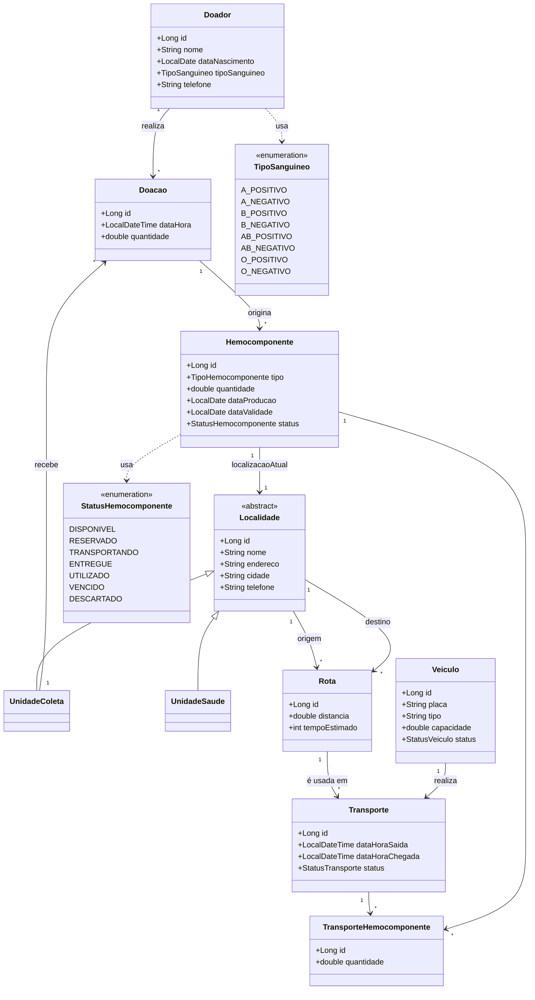

# Modelo de Domínio — Hemobit

Documento de referência do modelo de domínio da aplicação Hemobit (Rota Vital — 3º semestre, ADS, CESAR School), construído em Java/Spring Boot com persistência em PostgreSQL via JPA/Hibernate.

## Diagrama de classes

> Observação: `TipoHemocomponente`, `StatusVeiculo` e `StatusTransporte` são enums adicionais, omitidos do diagrama por brevidade visual — detalhados na seção de entidades abaixo.

## Lista de entidades

### Doador
Pessoa que realiza a doação de sangue.
- `id` (PK)
- `nome`
- `dataNascimento`
- `tipoSanguineo` (enum `TipoSanguineo`)
- `telefone`
- **Relacionamento:** 1 Doador → N Doacao

### Doacao
Evento de coleta de sangue de um doador.
- `id` (PK)
- `dataHora`
- `quantidade`
- `doador` (FK → Doador, N:1)
- `unidadeColeta` (FK → UnidadeColeta, N:1)
- **Relacionamento:** 1 Doacao → N Hemocomponente (uma doação é separada em múltiplos hemocomponentes)

### Hemocomponente
Unidade de sangue processada, pronta para uso ou distribuição.
- `id` (PK)
- `tipo` (enum `TipoHemocomponente`: CONCENTRADO_HEMACIAS, CONCENTRADO_PLAQUETAS, PLASMA_FRESCO_CONGELADO)
- `quantidade`
- `dataProducao`
- `dataValidade`
- `status` (enum `StatusHemocomponente`)
- `doacao` (FK → Doacao, N:1)
- `localizacaoAtual` (FK → Localidade, N:1) — onde o hemocomponente está fisicamente agora

> **Nota de escopo:** a lista de tipos de hemocomponente acima segue o MVP definido pelo grupo (Concentrado de Hemácias, Concentrado de Plaquetas, Plasma Fresco Congelado). Uma versão anterior do modelo considerava 5 tipos (incluindo Sangue Total e Crioprecipitado); ajustar aqui se a equipe decidir expandir o escopo.

### Localidade (classe abstrata)
Representa um local físico do sistema. Superclasse de `UnidadeColeta` e `UnidadeSaude`, mapeada com herança `SINGLE_TABLE` (coluna discriminadora `tipo_localidade`).
- `id` (PK)
- `nome`
- `endereco`
- `cidade`
- `telefone`

### UnidadeColeta (extends Localidade)
Hemocentro — local onde doações são realizadas e hemocomponentes podem ser armazenados.
- **Relacionamento:** 1 UnidadeColeta → N Doacao

### UnidadeSaude (extends Localidade)
Hospital — destino de requisições de hemocomponentes.

### Rota
Caminho entre duas localidades (origem e destino), usado para planejar transportes.
- `id` (PK)
- `origem` (FK → Localidade, N:1)
- `destino` (FK → Localidade, N:1)
- `distancia`
- `tempoEstimado`
- **Relacionamento:** 1 Rota → N Transporte (uma rota é usada em vários transportes ao longo do tempo)

### Veiculo
Veículo usado para transportar hemocomponentes.
- `id` (PK)
- `placa`
- `tipo`
- `capacidade`
- `status` (enum `StatusVeiculo`: DISPONIVEL, EM_ROTA, MANUTENCAO)

### Transporte
Evento de movimentação de hemocomponentes por uma rota, usando um veículo.
- `id` (PK)
- `dataHoraSaida`
- `dataHoraChegada`
- `status` (enum `StatusTransporte`: AGENDADO, EM_ANDAMENTO, CONCLUIDO, CANCELADO)
- `rota` (FK → Rota, N:1)
- `veiculo` (FK → Veiculo, N:1)

### TransporteHemocomponente (entidade associativa)
Resolve o relacionamento N:N entre `Transporte` e `Hemocomponente`, carregando o atributo `quantidade` transportada de cada hemocomponente naquele transporte específico.
- `id` (PK)
- `transporte` (FK → Transporte, N:1)
- `hemocomponente` (FK → Hemocomponente, N:1)
- `quantidade`

## Regras de validade

**Ciclo de vida do status do Hemocomponente**, em ordem esperada de transição:

`DISPONIVEL` → `RESERVADO` → `TRANSPORTANDO` → `ENTREGUE` → `UTILIZADO`

Com dois estados terminais alternativos, alcançáveis a partir de `DISPONIVEL` ou `RESERVADO`:
- `VENCIDO` — quando `dataValidade` é ultrapassada antes do uso.
- `DESCARTADO` — quando o hemocomponente é inutilizado por outro motivo (contaminação, dano no transporte, etc.).

**Regra de validade (FEFO — First Expired, First Out):** ao selecionar um hemocomponente para atender uma requisição, o sistema deve priorizar o hemocomponente `DISPONIVEL` com a `dataValidade` mais próxima, para minimizar descarte por vencimento.

**Regra de localização:** `Hemocomponente.localizacaoAtual` deve ser atualizada a cada mudança relevante de estado — por exemplo, ao entrar em status `TRANSPORTANDO`, a localização reflete o destino planejado do `Transporte` em andamento; ao chegar (`ENTREGUE`), reflete a `UnidadeSaude` de destino.

**Regra de integridade doador–doação:** uma `Doacao` não pode existir sem um `Doador` e uma `UnidadeColeta` associados (campos `nullable = false` nas FKs).

**Regra de cadeia fria (simplificada):** todo `Transporte` está sujeito a um tempo máximo aceitável entre `dataHoraSaida` e `dataHoraChegada`; ultrapassar esse limite é tratado como risco de ruptura de cadeia fria (regra a ser refinada em conjunto com a disciplina de AED, que modela o grafo de rotas e pesos).

## Como o modelo é consumido pelas outras disciplinas

- **AED:** o grafo de rotas (nós = `Localidade`/`Veiculo`, arestas = `Rota` com pesos) opera sobre os mesmos identificadores de `Localidade` definidos aqui, garantindo que o algoritmo de caminho mínimo e a compatibilidade ABO/Rh trabalhem sobre o mesmo domínio persistido por POO.
- **Estatística:** os indicadores (demanda por período, taxa de descarte, tempo médio de atendimento) são calculados a partir dos dados de `Doacao`, `Hemocomponente` e `Transporte` expostos pela camada de repositório.
