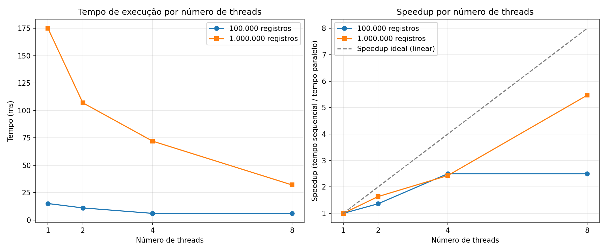

# Paralelismo na Detecção de Hemocomponentes Próximos do Vencimento

Disciplina: Infraestrutura de Software — Projeto Integrador Rota Vital (Hemobit)

## 1. Justificativa

### Operação escolhida

A operação selecionada foi a **detecção de hemocomponentes próximos do vencimento**: para cada registro do estoque, calcular quantos dias faltam até a data de validade e classificá-lo em uma categoria de urgência (`VENCIDO`, `URGENTE`, `ATENCAO`, `OK`), produzindo uma contagem agregada por categoria.

### Complexidade da solução sequencial

O algoritmo percorre a lista de hemocomponentes uma única vez, aplicando um cálculo de diferença de datas e uma comparação de faixas para cada item, sem nenhuma dependência entre itens. A complexidade é **O(n)**, onde *n* é o número de hemocomponentes.

### Onde está o gargalo

O gargalo está inteiramente na **CPU**, não em I/O. Os dados são gerados sinteticamente e mantidos em memória (uma `List` Java) — não há consulta a banco de dados nem chamada de rede durante a medição. O tempo gasto é 100% resultado do cálculo de datas e da atualização das contagens, repetido *n* vezes. Isso diferencia esta operação de, por exemplo, uma consulta ao estoque via `Hemocomponente Repository.findAll()`, onde o tempo seria dominado pela latência do PostgreSQL — nesse caso, paralelizar o lado da aplicação não traria ganho relevante, porque o gargalo estaria fora da JVM.

### Por que os dados são particionáveis

A classificação de um hemocomponente não depende do resultado da classificação de nenhum outro — cada item pode ser avaliado de forma totalmente independente. Isso permite dividir a lista em fatias contíguas (ex.: os primeiros 25%, os próximos 25%, etc.) e processar cada fatia em uma thread separada, sem nenhuma thread precisar esperar ou consultar o resultado de outra durante o processamento. A única sincronização necessária acontece **depois** que todas as threads terminam, ao somar as contagens parciais de cada fatia em um resultado final único.

## 2. O serviço

A operação foi implementada como um endpoint real na aplicação Spring Boot do Hemobit (mesma stack do Projeto Integrador), no pacote `com.hemobit.hemobit.benchmark`:

- `GeradorDadosSinteticos` — gera *n* hemocomponentes fictícios (com seed fixa, para garantir que a versão sequencial e a paralela processem exatamente o mesmo conjunto de dados).
- `DetectorVencimentoService` — contém a lógica sequencial (`detectarSequencial`) e a paralela (`detectarParalelo`, usando `ExecutorService`).
- `BenchmarkController` — expõe `GET /benchmark/deteccao-vencimento` (compara uma configuração específica) e `GET /benchmark/deteccao-vencimento/suite` (roda a bateria completa de tamanhos × configurações de threads).

## 3. Duas versões, mesma resposta

- **Sequencial:** um laço simples percorre toda a lista numa única thread, atualizando um mapa de contagens.
- **Paralela:** a lista é dividida em `numThreads` fatias de tamanho aproximadamente igual. Cada fatia é processada por uma tarefa (`Callable`) submetida a um `ExecutorService` (`newFixedThreadPool`), que devolve seu próprio mapa de contagens parciais via `Future`. Depois que todas as tarefas terminam (`future.get()`), os mapas parciais são somados em uma única thread (a principal), produzindo o resultado final.

Como nenhuma thread escreve em uma variável compartilhada durante o processamento — cada uma mantém seu próprio mapa local até o fim — não há race condition. Isso foi verificado na prática: o endpoint `/benchmark/deteccao-vencimento` compara as contagens da versão sequencial com as da paralela e retorna `resultadosIguais: true` em todas as execuções realizadas, confirmando que as duas abordagens produzem exatamente a mesma resposta.

## 4. Medições

As medições foram feitas para dois tamanhos de entrada (100.000 e 1.000.000 de registros) e quatro configurações (sequencial, 2, 4 e 8 threads), após uma etapa de *warm-up* — a JVM executa a operação algumas vezes antes de cada medição, descartando os resultados, para evitar que a versão sequencial (medida primeiro) seja penalizada por rodar "fria" (sem as otimizações do compilador JIT que as execuções seguintes já aproveitam).

| Tamanho | Threads | Tempo (ms) | Speedup |
|---|---|---|---|
| 100.000 | 1 (sequencial) | 15 | 1,00 |
| 100.000 | 2 | 11 | 1,36 |
| 100.000 | 4 | 6 | 2,50 |
| 100.000 | 8 | 6 | 2,50 |
| 1.000.000 | 1 (sequencial) | 175 | 1,00 |
| 1.000.000 | 2 | 107 | 1,64 |
| 1.000.000 | 4 | 72 | 2,43 |
| 1.000.000 | 8 | 32 | 5,47 |



**Observação sobre a confiabilidade dos dados de 100.000 registros:** as medições com 4 e 8 threads para esse tamanho produziram o mesmo tempo (6ms), o que é estatisticamente improvável de refletir desempenho real idêntico. A causa mais provável é a resolução do relógio do sistema: `System.currentTimeMillis()` no Windows tem granularidade de aproximadamente 15ms por padrão, então operações que levam poucos milissegundos de fato ficam sujeitas a arredondamento para o próximo "tick" do relógio, distorcendo a medição. Os dados de 1.000.000 de registros, com tempos entre 32ms e 175ms, estão menos sujeitos a essa distorção e são a base mais confiável para a análise a seguir. Uma correção possível para trabalhos futuros é substituir `currentTimeMillis()` por `System.nanoTime()`, que tem resolução mais fina.

## 5. Análise

O ganho não foi linear em nenhuma das duas escalas. Para 1.000.000 de registros — o conjunto mais confiável — o speedup passou de 1,64x com 2 threads para 2,43x com 4 threads: dobrar as threads não dobrou o ganho. Parte disso é overhead genuíno de paralelismo: criar o pool de threads, dividir a lista, submeter tarefas ao `ExecutorService` e sincronizar os `Future.get()` no final consome tempo que não existe na versão sequencial, e esse custo fixo pesa proporcionalmente mais quanto menor for a fatia de trabalho por thread. Também há o limite físico de núcleos de CPU disponíveis na máquina: a partir de um certo número de threads, novas threads passam a competir pelo mesmo hardware em vez de ganhar paralelismo real, e o sistema operacional gasta tempo alternando entre elas (*context switching*) em vez de executá-las simultaneamente.

O salto de 4 para 8 threads em 1.000.000 de registros (de 2,43x para 5,47x) foge do padrão de desaceleração esperado e é maior do que o dobro de threads deveria render de forma "limpa". Isso sugere que a máquina onde o teste rodou tem mais de 4 núcleos lógicos disponíveis (comum em processadores atuais com *hyperthreading*), e que 4 threads não saturava ainda a capacidade de paralelismo real do hardware — só ao chegar em 8 threads o ganho de núcleos adicionais se tornou visível de forma mais acentuada.

A complexidade assintótica **não mudou**: tanto a versão sequencial quanto a paralela continuam sendo O(n) — cada item ainda é visitado exatamente uma vez, e a soma das contagens parciais ao final é O(k), onde k é o número de threads (uma constante pequena frente a n). O que threads mudam não é a ordem de crescimento do algoritmo, e sim a **constante** que multiplica esse n — várias unidades de trabalho executando ao mesmo tempo dividem o tempo total de parede (*wall-clock time*), mas o volume total de trabalho computacional realizado continua o mesmo (na prática, ligeiramente maior, por causa do overhead de coordenação).

Isso conecta com a diferença entre **concorrência** e **paralelismo**, que também apareceu na atividade da Mesa de DJ. Lá, as threads representavam instrumentos tocando eventos que aconteciam de forma intercalada no tempo — a preocupação central era coordenação e sincronização de eventos concorrentes, não necessariamente rodando ao mesmo tempo fisicamente, e sim alternando de forma organizada (concorrência). Aqui, o objetivo é diferente: não há eventos para coordenar, há um único volume de dados homogêneo que precisa ser processado mais rápido dividindo-o entre unidades de execução que rodam simultaneamente em núcleos distintos de CPU (paralelismo). Concorrência lida com a estrutura de várias tarefas acontecendo "ao mesmo tempo" logicamente; paralelismo lida com acelerar uma única tarefa grande dividindo-a fisicamente entre processadores.

Quando nem 8 threads bastarem — por exemplo, se o volume de dados crescer para dezenas de milhões de registros, ou se a operação precisar rodar para múltiplos hospitais/hemocentros simultaneamente — o próximo passo não é aumentar ainda mais o número de threads em uma única máquina, porque o paralelismo dentro de um processo está limitado ao número de núcleos físicos disponíveis nela. A evolução natural é distribuir o processamento entre **múltiplas máquinas** (escalonamento horizontal), particionando os dados entre instâncias diferentes da aplicação — por exemplo, usando uma fila de mensagens para distribuir lotes de trabalho entre workers, ou um framework de processamento distribuído. Esse é o ponto onde a arquitetura deixa de ser "uma aplicação com mais threads" e passa a ser "várias aplicações trabalhando em conjunto", que é o tipo de decisão arquitetural que a Unidade 2 deve aprofundar.

## Anexo — Como reproduzir as medições

```
GET /benchmark/deteccao-vencimento/suite
```
Executa a bateria completa (100.000 e 1.000.000 de registros × sequencial, 2, 4 e 8 threads) e devolve os tempos e speedups em JSON.

```
GET /benchmark/deteccao-vencimento?tamanho=1000000&threads=8
```
Executa uma configuração específica e devolve, além do tempo, as contagens por categoria das duas versões e o campo `resultadosIguais`, usado para confirmar a ausência de race conditions.
